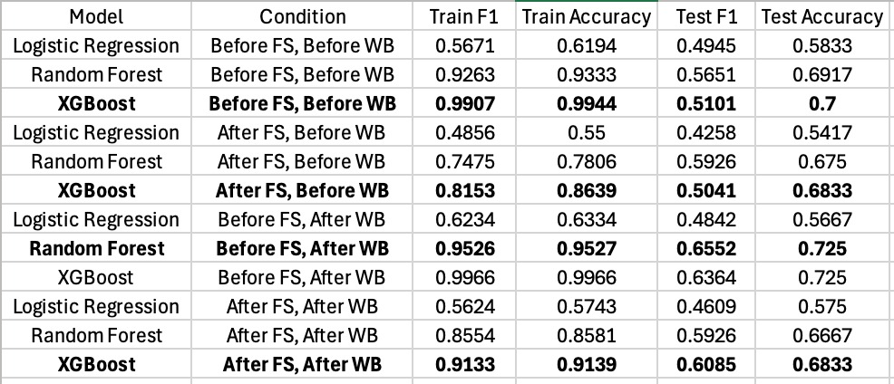
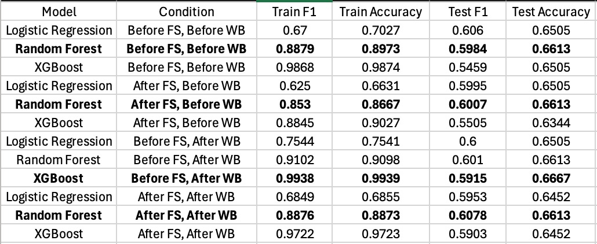

# Emotion Classification from Sound Events 

## Overview

This project aims to classify emotions from sound events using machine learning techniques. It leverages two datasets — **EmoSounds** and **IADSED** which include acoustic features like pitch, rhythm, timbre, and tonal characteristics. Emotions are predicted based on **arousal** and **valence** dimensions, categorized into four classes.

We implemented and evaluated three models:

- **Logistic Regression**
- **Random Forest**
- **XGBoost**

Performance was assessed using **accuracy** and **macro F1-score**, with preprocessing techniques like feature scaling, SMOTE balancing, and Recursive Feature Elimination (RFE) applied to improve model effectiveness.

---

## Files in the Repository

### 1. `Emotion-Classification.ipynb`
Contains all code for:
- **Dataset Preprocessing**:
  - Handling missing values
  - Feature scaling using `MinMaxScaler`
  - Label creation based on arousal-valence polarity
  - Dataset balancing with **SMOTE**
  - Feature selection using **RFE**
- **Model Training**:
  - Logistic Regression
  - Random Forest
  - XGBoost
- **Evaluation & Visualization**:
  - Accuracy and Macro F1-score metrics
  - Confusion matrices
  - Arousal vs. Valence scatter plots

### 2. `Emotion-Classification-Report.pdf`
A detailed project report including:
- Importance of emotion recognition from sound
- Dataset characteristics
- Preprocessing techniques
- Model architecture and rationale
- Comparative results
- Insights and future work suggestions

---

## Project Workflow

### Step 1: Dataset Preprocessing
- Drop nulls (IADSED)
- Scale features (range: `[-1, 1]`)
- Generate emotion labels:
  - `Class 0`: +Arousal, +Valence
  - `Class 1`: +Arousal, -Valence
  - `Class 2`: -Arousal, -Valence
  - `Class 3`: -Arousal, +Valence
- Balance classes using **SMOTE**

### Step 2: Feature Selection
- Apply **Recursive Feature Elimination (RFE)** with **Random Forest**

### Step 3: Model Training
Train the following models:
- Logistic Regression (efficient baseline)
- Random Forest (ensemble of decision trees)
- XGBoost (gradient boosting)

### Step 4: Evaluation
- **Accuracy**
- **Macro F1-score**

---

## Results Summary

### EmoSounds Dataset

### IADSED Dataset

---

## Key Insights

- **Random Forest** offered the best generalization, with solid performance across both datasets.
- **XGBoost** had the highest training accuracy but signs of overfitting.
- **Logistic Regression** showed the smallest gap between training and test performance but lower overall scores.

---
